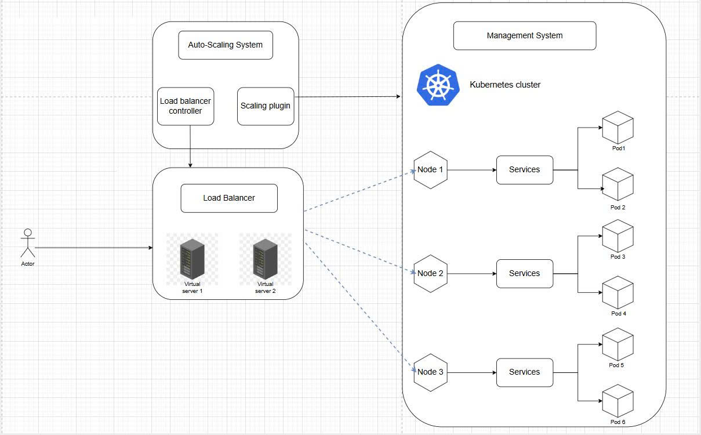
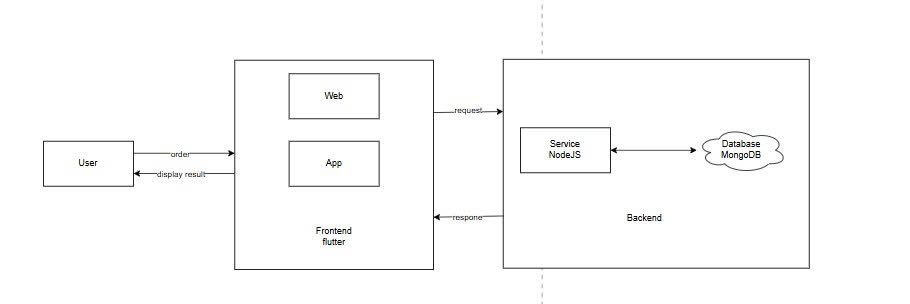

# Hệ thống Thương mại Điện tử dựa trên Microservices với AI-Driven Predictive Autoscaling

## Mục lục

1. [Giới thiệu](#1-giới-thiệu)
2. [Kiến trúc hệ thống](#2-kiến-trúc-hệ-thống)
3. [Yêu cầu hệ thống](#3-yêu-cầu-hệ-thống)
4. [Hướng dẫn cài đặt](#4-hướng-dẫn-cài-đặt)
5. [Hướng dẫn triển khai](#5-hướng-dẫn-triển-khai)
6. [Kịch bản kiểm thử](#6-kịch-bản-kiểm-thử)
7. [Monitoring và Debugging](#7-monitoring-và-debugging)
8. [API Documentation](#8-api-documentation)
9. [CI/CD Pipeline](#9-cicd-pipeline)

---

## 1. Giới thiệu

### 1.1. Tổng quan dự án

Dự án này trình bày việc triển khai một hệ thống thương mại điện tử hoàn chỉnh trên nền tảng **Microservices**, được quản lý bởi **Kubernetes**, với điểm nhấn đặc biệt là hệ thống **AI Autoscaler** sử dụng mô hình Hybrid **ARIMA-MLP** để dự đoán tải và tự động điều chỉnh số lượng Pod.

Khác với cơ chế Horizontal Pod Autoscaler (HPA) truyền thống chỉ phản ứng khi CPU/Memory đã đạt ngưỡng, hệ thống này sử dụng machine learning để **dự báo** lưu lượng truy cập trong tương lai, từ đó thực hiện **pre-warming** (chuẩn bị tài nguyên trước) nhằm tránh quá tải.

### 1.2. Mục tiêu

- Xây dựng hệ thống E-Commerce có khả năng tự động mở rộng dựa trên dự đoán tải bằng AI
- Triển khai kiến trúc Microservices với 3 services độc lập
- Áp dụng cơ chế giao tiếp bất đồng bộ thông qua Message Broker (RabbitMQ)
- Tích hợp hệ thống giám sát (Prometheus, Grafana) và tracing phân tán (Jaeger)
- Xây dựng CI/CD pipeline tự động với GitHub Actions

---

## 2. Kiến trúc hệ thống

### 2.1. Sơ đồ kiến trúc




### 2.2. Các thành phần chính

#### 2.2.1. Microservices Layer

| Service | Port | Database | Mô tả |
|---------|------|----------|-------|
| Product Service | 3001 | MongoDB Atlas | Quản lý thông tin sản phẩm |
| Order Service | 3002 | MongoDB Atlas | Xử lý đơn hàng, RabbitMQ Publisher |
| Inventory Service | 3003 | MongoDB Atlas | Quản lý tồn kho, RabbitMQ Consumer |

#### 2.2.2. API Gateway Layer

**Nginx** đóng vai trò Reverse Proxy và Load Balancer, điều phối requests đến các services tương ứng.

#### 2.2.3. Message Broker Layer

**RabbitMQ** với queue `order_processing_queue` durable, hỗ trợ asynchronous communication giữa Order Service và Inventory Service.

#### 2.2.4. Monitoring Layer

| Tool | Port | Mục đích |
|------|------|----------|
| Prometheus | 9090 | Thu thập metrics từ Kubernetes cAdvisor |
| Grafana | 3000 | Visualization Dashboard |
| Jaeger | 16686 | Distributed Tracing |

#### 2.2.5. AI Autoscaling Layer

**AI Autoscaler (Python)** kết hợp ARIMA và MLP Neural Network để dự đoán tải CPU và điều khiển Kubernetes HPA.

---

## 3. Yêu cầu hệ thống

### 3.1. Phần cứng

| Component | Tối thiểu | Khuyến nghị |
|-----------|-----------|-------------|
| CPU | 4 cores | 8+ cores |
| RAM | 8 GB | 16+ GB |
| Disk | 20 GB | 50+ GB SSD |

### 3.2. Phần mềm

| Software | Phiên bản | Mục đích |
|----------|-----------|----------|
| Docker Desktop | 4.0+ | Container runtime & Kubernetes |
| kubectl | 1.28+ | Kubernetes CLI |
| Python | 3.8+ | AI Autoscaler |
| Node.js | 18+ | Microservices runtime |
| k6 | 0.50+ | Load Testing |

### 3.3. Python Packages

```bash
pip install requests pandas statsmodels scikit-learn kubernetes numpy
```

---

## 4. Hướng dẫn cài đặt

### 4.1. Docker Desktop với Kubernetes

**Windows:**
1. Download Docker Desktop từ [docker.com](https://www.docker.com/products/docker-desktop)
2. Enable Kubernetes: Settings → Kubernetes → Enable Kubernetes
3. Restart Docker Desktop

**macOS:**
1. Download và cài đặt Docker Desktop
2. Enable Kubernetes trong Settings

**Xác minh:**
```bash
kubectl version --client
docker version
kubectl cluster-info
```

### 4.2. Python và Dependencies

```bash
# Verify Python version
python --version  # Python 3.8+

# Install packages
pip install requests pandas statsmodels scikit-learn kubernetes numpy
```

### 4.3. k6 (Load Testing Tool)

**Windows (PowerShell):**
```powershell
winget install k6
```

**macOS:**
```bash
brew install k6
```

**Linux:**
```bash
sudo apt-get install k6
```

---

## 5. Hướng dẫn triển khai

### 5.1. Triển khai Kubernetes Resources

```bash
cd backend

# Triển khai tất cả resources
kubectl apply -f k8s-master.yaml

# Theo dõi pods
kubectl get pods -w
```

### 5.2. Triển khai Monitoring Stack

```bash
# Prometheus và Grafana
kubectl apply -f monitoring-stack.yaml

# Jaeger
kubectl apply -f jaeger-stack.yaml
```

### 5.3. Triển khai Nginx API Gateway

```bash
docker-compose -f docker-compose.yml up -d
```

### 5.4. Xác minh triển khai

```bash
# Liệt kê resources
kubectl get all

# Kiểm tra HPAs
kubectl get hpa
```

### 5.5. Truy cập Dashboards

```bash
# Prometheus
kubectl port-forward svc/prometheus 9090:9090

# Grafana (admin/admin)
kubectl port-forward svc/grafana 3000:3000

# Jaeger
kubectl port-forward svc/jaeger 16686:16686
```

| Service | URL |
|---------|-----|
| Prometheus | http://localhost:9090 |
| Grafana | http://localhost:3000 |
| Jaeger | http://localhost:16686 |

---

## 6. Kịch bản kiểm thử

### 6.1. Kịch bản 1: Baseline (Không Autoscaling)

**Mục đích:** Đo hiệu suất hệ thống khi không có auto-scaling để làm baseline.

```powershell
# Xóa HPA và scale về 2 replicas
kubectl delete hpa --all
kubectl scale deployment order-service --replicas=2

# Theo dõi pods
kubectl get pods -w

# Chạy load test
Get-Content test_internal.js | kubectl run k6-load-test -i --rm --image=grafana/k6 --restart=Never -- run -
```

### 6.2. Kịch bản 2: Kubernetes HPA

**Mục đích:** So sánh HPA truyền thống với AI Autoscaler.

```powershell
# Bật HPA
kubectl apply -f k8s-master.yaml

# Theo dõi
kubectl get pods -w
kubectl get hpa

# Chạy load test
Get-Content test_internal.js | kubectl run k6-load-test -i --rm --image=grafana/k6 --restart=Never -- run -
```

### 6.3. Kịch bản 3: AI Autoscaler (ARIMA + MLP)

**Mục đích:** Demo khả năng dự đoán và pre-warming.

```powershell
# Tắt HPA
kubectl delete hpa --all
kubectl scale deployment order-service --replicas=2

# Chạy AI Autoscaler (terminal riêng)
cd backend
python upgrade.py

# Chạy load test (terminal khác)
Get-Content test_internal.js | kubectl run k6-load-test -i --rm --image=grafana/k6 --restart=Never -- run -
```

---

## 7. Monitoring và Debugging

### 7.1. Prometheus Queries

```promql
# CPU Usage
avg(rate(container_cpu_usage_seconds_total{pod=~"order-service-.*"}[1m])) * 100

# Memory Usage
avg(rate(container_memory_working_set_bytes{pod=~"order-service-.*"}[1m])) / 1024 / 1024

# Pod Count
count(kube_pod_info{pod=~"order-service-.*"})
```

### 7.2. Kubernetes Commands

```bash
# Logs
kubectl logs -f deployment/order-service
kubectl logs <pod-name>

# Describe
kubectl describe pod <pod-name>

# Exec
kubectl exec -it <pod-name> -- /bin/sh

# Events
kubectl get events --sort-by='.lastTimestamp'

# Resource usage
kubectl top pods
kubectl top nodes
```

### 7.3. RabbitMQ Management

```bash
kubectl port-forward svc/rabbitmq 15672:15672
# Truy cập: http://localhost:15672 (guest/guest)
```

---

## 8. API Documentation

### 8.1. Product Service (Port 3001)

| Method | Endpoint | Description |
|--------|----------|-------------|
| POST | /api/products | Tạo sản phẩm |
| GET | /api/products | Danh sách sản phẩm |
| GET | /api/products/:id | Chi tiết sản phẩm |
| PUT | /api/products/:id | Cập nhật sản phẩm |
| DELETE | /api/products/:id | Xóa sản phẩm |
| GET | /health | Health check |

**Swagger UI:** http://localhost:3001/api-docs

### 8.2. Order Service (Port 3002)

| Method | Endpoint | Description |
|--------|----------|-------------|
| POST | /api/orders | Tạo đơn hàng |
| GET | /api/orders | Danh sách đơn hàng |

**Swagger UI:** http://localhost:3002/api-docs

### 8.3. Inventory Service (Port 3003)

| Method | Endpoint | Description |
|--------|----------|-------------|
| POST | /api/inventory | Tạo inventory |
| GET | /api/inventory | Danh sách tồn kho |
| POST | /api/inventory/increase | Tăng tồn kho |
| POST | /api/inventory/decrease | Giảm tồn kho |

**Swagger UI:** http://localhost:3003/api-docs

---

## 9. CI/CD Pipeline

### 9.1. GitHub Actions

Pipeline tự động build và push Docker images khi có push vào thư mục `backend/`.

### 9.2. Docker Hub Images

| Service | Image URL |
|---------|-----------|
| Product Service | `buiducthien090605/my-product-service:latest` |
| Order Service | `buiducthien090605/my-order-service:latest` |
| Inventory Service | `buiducthien090605/my-inventory-service:latest` |

---

## Công nghệ sử dụng

| Category | Technologies |
|----------|--------------|
| Backend | Node.js 18, Express.js 5.2.1, Mongoose 9.3.3 |
| Database | MongoDB Atlas, RabbitMQ 3.12 |
| Container | Docker 24.0, Kubernetes 1.28, Nginx Alpine |
| Monitoring | Prometheus 2.47, Grafana 10.2, Jaeger 1.52 |
| AI/ML | Python 3.11, Statsmodels 0.14, Scikit-learn 1.3 |
| Testing | k6 0.50, GitHub Actions |

---

## Troubleshooting

### Pods không khởi động được
```bash
kubectl describe pod <pod-name>
kubectl logs <pod-name>
```

### ImagePullBackOff
```bash
# Kiểm tra image
kubectl get deployment <name> -o jsonpath='{.spec.template.spec.containers[*].image}'
docker login
```

### AI Autoscaler không kết nối được
```bash
kubectl config current-context
kubectl cluster-info
```

---

## CI/CD Status
test
